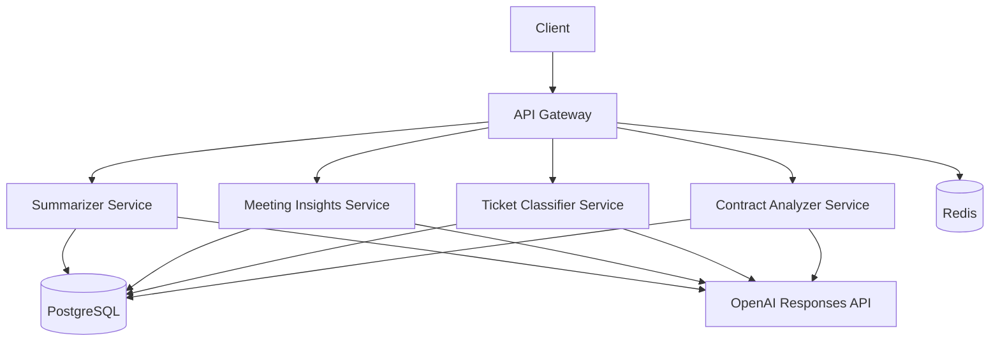

# ai-enterprise-microservices
**Enterprise AI microservice reference architecture with FastAPI + OpenAI Responses API.**

## Why this project matters
Modern enterprises need AI capabilities without coupling every workflow into one monolith. This repo demonstrates a production-style, service-oriented backend where AI tasks are split into independently deployable APIs with shared governance.

## Enterprise use cases
- HR/ops policy summarization
- PMO/leadership meeting insights extraction
- IT/helpdesk ticket triage
- Procurement/legal contract risk screening (not legal advice)

## Architecture overview
- Gateway: routing, request IDs, cache, rate limiting, history API
- Four AI microservices with structured outputs
- Shared library: config, middleware, OpenAI client, DB models, schemas
- PostgreSQL persistence + Redis cache/rate-limit state



## Repository structure
```text
ai-enterprise-microservices/
  gateway/app/
  services/{summarizer,meeting_insights,ticket_classifier,contract_analyzer}/app/
  shared/{ai,core,db,logging,schemas,prompts,utils}/
  alembic/ examples/ tests/ docs/ .github/workflows/
```

## Key features
- OpenAI Responses API with JSON schema structured outputs
- Correlation IDs (`x-request-id`) + latency metadata
- Consistent response envelope
- SQLAlchemy + Alembic persistence of request metadata/results
- Redis cache and gateway-level rate limiting
- Dockerized local environment + CI, lint, tests

## Prerequisites
- Docker / Docker Compose
- Python 3.12 (for local non-container runs)

## Environment variables
| Variable | Description |
|---|---|
| OPENAI_API_KEY | OpenAI API key |
| OPENAI_MODEL_SUMMARIZER / MEETING / CLASSIFIER / CONTRACT | Service model names |
| OPENAI_REQUEST_TIMEOUT_SECONDS | OpenAI request timeout |
| POSTGRES_DSN | SQLAlchemy DSN |
| REDIS_URL | Redis URL |

## Quickstart (Docker)
```bash
cp .env.example .env
docker compose up --build
```

## Migrations
```bash
alembic upgrade head
python scripts/seed_prompts.py
```

## API endpoints
Gateway:
- `GET /healthz`
- `GET /readyz`
- `GET /api/v1/services`
- `GET /api/v1/history`
- `POST /api/v1/summarize`
- `POST /api/v1/meeting-insights`
- `POST /api/v1/classify-ticket`
- `POST /api/v1/analyze-contract`

## cURL examples
### Summarize
```bash
curl -X POST http://localhost:8000/api/v1/summarize -H "Content-Type: application/json" -d @examples/summarizer/policy.json
```
### Meeting insights
```bash
curl -X POST http://localhost:8000/api/v1/meeting-insights -H "Content-Type: application/json" -d @examples/meetings/board_transcript.json
```
### Ticket classification
```bash
curl -X POST http://localhost:8000/api/v1/classify-ticket -H "Content-Type: application/json" -d @examples/tickets/sample_ticket.json
```
### Contract analysis
```bash
curl -X POST http://localhost:8000/api/v1/analyze-contract -H "Content-Type: application/json" -d @examples/contracts/saas_clause.json
```

## Shared response envelope
```json
{
  "status": "ok",
  "data": {"summary": "..."},
  "meta": {
    "request_id": "a3af...",
    "service": "summarizer",
    "model": "gpt-4.1-mini",
    "latency_ms": 423.1,
    "cached": false,
    "usage": {"input_tokens": 120, "output_tokens": 90, "total_tokens": 210}
  }
}
```

## Example outputs
Each service returns structured JSON as documented in `shared/schemas/service_models.py`.

## Testing
```bash
pytest -q
```

## Linting / formatting
```bash
ruff check .
ruff format .
```

## Troubleshooting
- Ensure `.env` has `OPENAI_API_KEY`
- Confirm containers healthy: `docker compose ps`
- Re-run migrations if history endpoint fails

## Design decisions / trade-offs
- Stored only sanitized previews (not full raw text) by default for safer logging/persistence.
- Gateway cache keys use text hash; useful for repeated internal workflows.

## Limitations
- Demo auth is pass-through only
- Cost estimation is heuristic
- No long-running async queue in this version

## Roadmap
- Prompt version endpoint
- JWT/OIDC auth
- Better per-model cost tables

## Security / privacy notes
- Inputs are length-limited and sanitized for storage previews
- Secrets stay in environment variables
- Contract analyzer is a risk-screening assistant and **not legal advice**

## License
MIT
